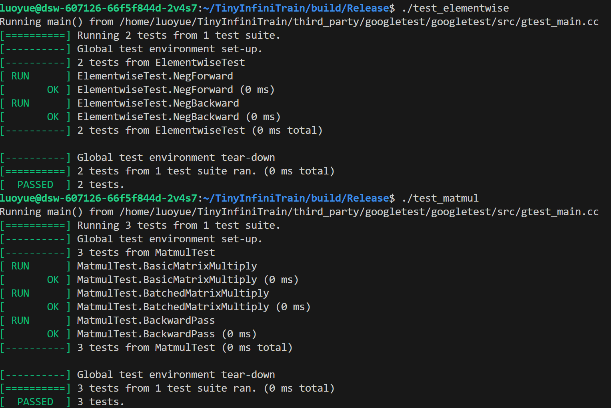
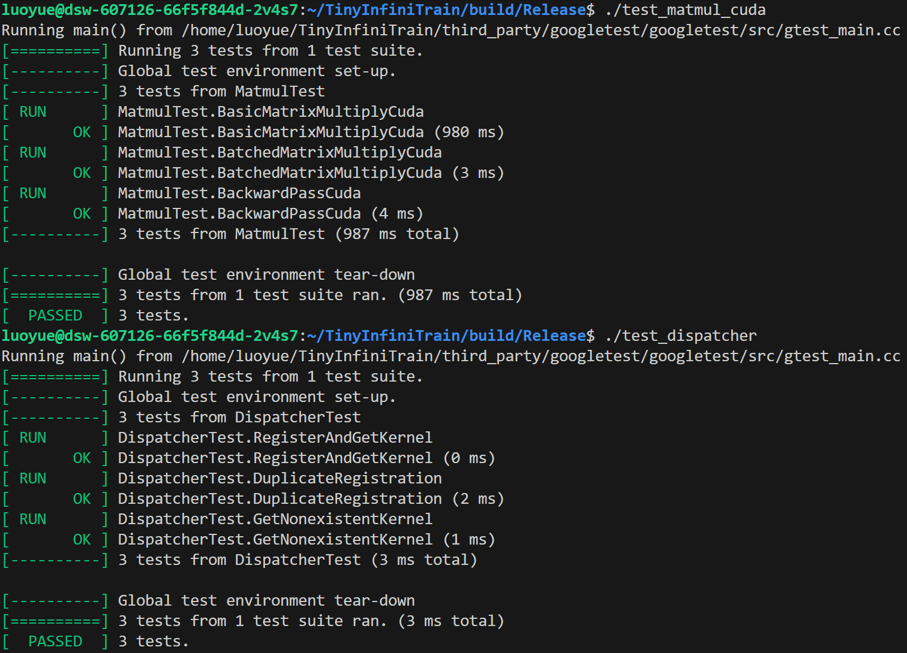
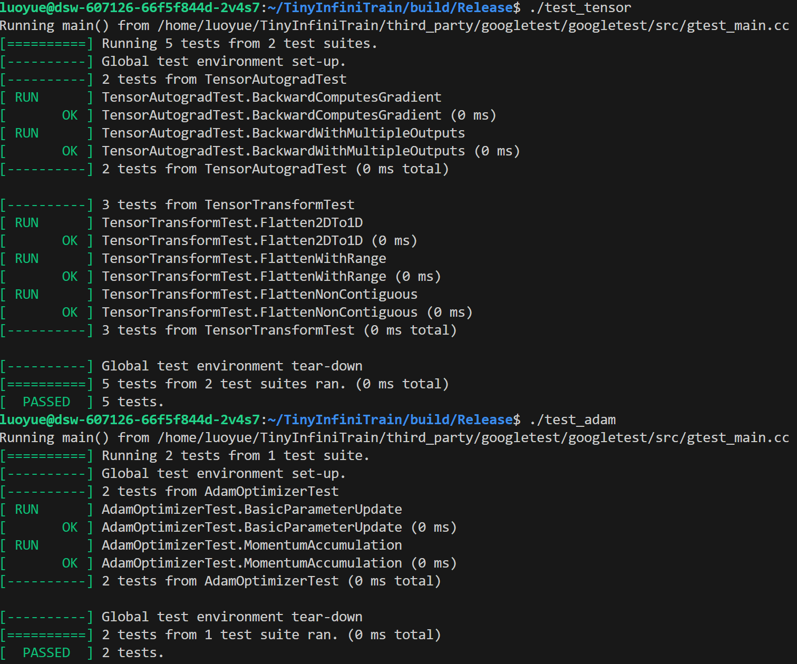
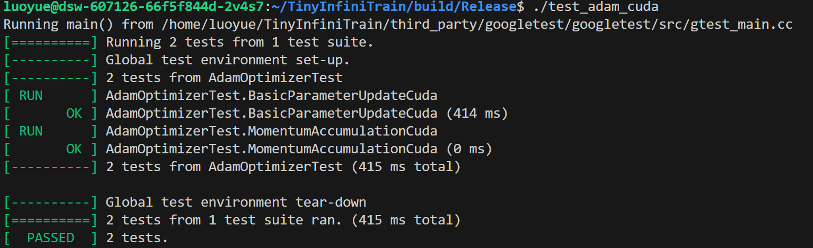
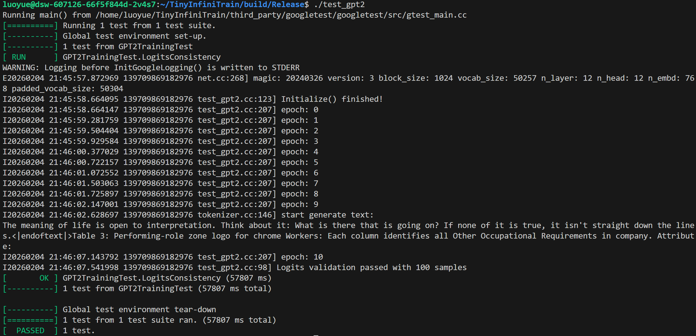

# TinyInfiniTrain 作业报告

## 一、test 通过截图







## 二、作业步骤

> 将代码填入下面代码块中指定位置，并详细描述完成该作业的解决思路和遇到的问题。

### 作业一：autograd机制调用Neg kernel的实现

难度：⭐

对应测例：`TEST(ElementwiseTest, NegForward)`，`TEST(ElementwiseTest, NegBackward)`

需要实现的代码块位置：`infini_train/src/autograd/elementwise.cc`

```c++
std::vector<std::shared_ptr<Tensor>> Neg::Forward(const std::vector<std::shared_ptr<Tensor>> &input_tensors) {
    // =================================== 作业 ===================================
    // TODO：通过Dispatcher获取设备专属kernel，对输入张量进行取反操作
    // NOTES: 依赖test_dispatcher，Neg kernel实现已给出
    // =================================== 作业 ===================================
    CHECK_EQ(input_tensors.size(), 1);
    const auto &input = input_tensors[0];

    auto device = input->GetDevice().Type();
    auto kernel = Dispatcher::Instance().GetKernel({device, "NegForward"});
    return {kernel.Call<std::shared_ptr<Tensor>>(input)};
}

std::vector<std::shared_ptr<Tensor>> Neg::Backward(const std::vector<std::shared_ptr<Tensor>> &grad_outputs) {
    // =================================== 作业 ===================================
    // TODO：通过Dispatcher获取设备专属的反向传播kernel，计算梯度
    // NOTES: 依赖test_dispatcher，Neg的kernel实现已给出
    // =================================== 作业 ===================================

    CHECK_EQ(grad_outputs.size(), 1);
    const auto &grad_output = grad_outputs[0];

    auto device = grad_output->GetDevice().Type();
    auto kernel = Dispatcher::Instance().GetKernel({device, "NegBackward"});
    return {kernel.Call<std::shared_ptr<Tensor>>(grad_output)};
}
```

#### 解决思路
仿照文件内其他算子的实现，调用Dispatcher获取设备专属kernel，对输入张量进行取反操作。

#### 遇到问题
无


### 作业二：实现矩阵乘法

难度：⭐⭐

#### CPU实现

对应测例：`TEST(MatmulTest, BasicMatrixMultiply)`，`TEST(MatmulTest, BatchedMatrixMultiply)`, `TEST(MatmulTest, BackwardPass)`

需要实现的代码块位置：`infini_train/src/kernels/cpu/linear.cc`

```c++
    namespace infini_train::kernels::cpu {
std::shared_ptr<Tensor> MatmulForward(const std::shared_ptr<Tensor> &input, const std::shared_ptr<Tensor> &other) {
    // =================================== 作业 ===================================
    // TODO：实现CPU上的矩阵乘法前向计算
    // REF:
    // =================================== 作业 ===================================

    const auto &input_dims = input->Dims();
    const int64_t bs = std::accumulate(input_dims.rbegin() + 2, input_dims.rend(), 1, std::multiplies<int64_t>{});
    const auto &other_dims = other->Dims();
    
    for (int64_t i = 0; i < input_dims.size() - 2; ++i) {
        CHECK_EQ(input_dims[i], other_dims[i]) << "Batch dims must match";
    }

    // get m,n,k
    const int64_t m = input_dims[input_dims.size() - 2];
    const int64_t n = other_dims[other_dims.size() - 1];
    const int64_t k = input_dims[input_dims.size() - 1];
    CHECK_EQ(k, other_dims[other_dims.size() - 2]);

    auto output_dims = input_dims;
    output_dims[output_dims.size() - 1] = n;
    auto output = std::make_shared<Tensor>(output_dims, DataType::kFLOAT32);
    // use Eigen for matmul
    for (int64_t b = 0; b < bs; b++) {
        output->EigenMatrix().block(b * m, 0, m, n)
            = input->EigenMatrix().block(b * m, 0, m, k) * other->EigenMatrix().block(b * k, 0, k, n);
    }

    return {output};
}

std::tuple<std::shared_ptr<Tensor>, std::shared_ptr<Tensor>>
MatmulBackward(const std::shared_ptr<Tensor> &input, const std::shared_ptr<Tensor> &other,
               const std::shared_ptr<Tensor> &grad_output) {
    // =================================== 作业 ===================================
    // TODO：实现CPU上的矩阵乘法反向传播
    // REF:
    // =================================== 作业 ===================================

    const auto &input_dims = input->Dims();
    const auto &other_dims = other->Dims();
    const auto &grad_output_dims = grad_output->Dims();
    const int64_t bs = std::accumulate(input_dims.rbegin() + 2, input_dims.rend(), 1, std::multiplies<int64_t>{});

    for (int64_t i = 0; i < input_dims.size() - 2; ++i) {
        CHECK_EQ(input_dims[i], other_dims[i]) << "Batch dims must match";
        CHECK_EQ(input_dims[i], grad_output_dims[i]) << "Batch dims must match";
    }
    // get m,n,k
    const int64_t m = input_dims[input_dims.size() - 2];
    const int64_t n = other_dims[other_dims.size() - 1];
    const int64_t k = input_dims[input_dims.size() - 1];
    CHECK_EQ(k, other_dims[other_dims.size() - 2]);

    auto grad_input = std::make_shared<Tensor>(input_dims, DataType::kFLOAT32);
    auto grad_other = std::make_shared<Tensor>(other_dims, DataType::kFLOAT32);

    grad_input->EigenMatrix().setZero();
    grad_other->EigenMatrix().setZero();

    for (int64_t b = 0; b < bs; ++b) {
        grad_input->EigenMatrix().block(b * m, 0, m, k)
            = grad_output->EigenMatrix().block(b * m, 0, m, n) * other->EigenMatrix().block(b * k, 0, k, n).transpose();
        grad_other->EigenMatrix().block(b * k, 0, k, n)
            = input->EigenMatrix().block(b * m, 0, m, k).transpose() * grad_output->EigenMatrix().block(b * m, 0, m, n);
    }
    return {grad_input, grad_other};
}
```

#### CUDA实现

对应测例：`TEST(MatmulTest, BasicMatrixMultiplyCuda)`,`TEST(MatmulTest, BatchedMatrixMultiplyCuda)`,`TEST(MatmulTest, BackwardPassCuda)`

需要实现的代码块位置：`infini_train/src/kernels/cuda/linear.cu`

```c++
    std::shared_ptr<Tensor> MatmulForward(const std::shared_ptr<Tensor> &input, const std::shared_ptr<Tensor> &other) {
    // =================================== 作业 ===================================
    // TODO：实现CUDA上的矩阵乘法前向计算
    // REF:
    // =================================== 作业 ===================================

    // auto output = std::make_shared<Tensor>();
    const auto &input_dims = input->Dims();
    const auto &other_dims = other->Dims();

    CHECK_GE(input_dims.size(), 2);
    CHECK_GE(other_dims.size(), 2);
    CHECK_EQ(input_dims.size(), other_dims.size());

    const int64_t bs = std::accumulate(input_dims.rbegin() + 2, input_dims.rend(), 1, std::multiplies<int64_t>{});
    for (int64_t i = 0; i < input_dims.size() - 2; i++) { CHECK_EQ(input_dims[i], other_dims[i]); }
    // get m,n,k
    const int64_t m = input_dims[input_dims.size() - 2];
    const int64_t k = input_dims[input_dims.size() - 1];
    const int64_t n = other_dims[other_dims.size() - 1];

    CHECK_EQ(input_dims[input_dims.size() - 1], other_dims[other_dims.size() - 2]);
    // check dims
    CHECK_EQ(other_dims[other_dims.size() - 2], k);
    auto dtype = input->Dtype();
    std::vector<int64_t> output_dims = input_dims;
    output_dims[output_dims.size() - 1] = n;
    auto output = std::make_shared<Tensor>(output_dims, dtype, input->GetDevice());
    const float alpha = 1.0f;
    const float beta = 0.0f;
    cublasHandle_t handle;
    CUBLAS_CHECK(cublasCreate(&handle));

    int lda = n;
    int ldb = k;
    int ldc = n;

    int64_t batch_stride_a = n * k;
    int64_t batch_stride_b = k * m;
    int64_t batch_stride_c = n * m;

    switch (dtype) {
    case DataType::kFLOAT32:
        CUBLAS_CHECK(cublasGemmStridedBatchedEx(handle, CUBLAS_OP_N, CUBLAS_OP_N, n, m, k, &alpha, other->DataPtr(),
                                                CUDA_R_32F, lda, batch_stride_a, input->DataPtr(), CUDA_R_32F, ldb,
                                                batch_stride_b, &beta, output->DataPtr(), CUDA_R_32F, ldc,
                                                batch_stride_c, bs, CUDA_R_32F, CUBLAS_GEMM_DEFAULT));
        break;
    case DataType::kBFLOAT16:
        CUBLAS_CHECK(cublasGemmStridedBatchedEx(handle, CUBLAS_OP_N, CUBLAS_OP_N, n, m, k, &alpha, other->DataPtr(),
                                                CUDA_R_16BF, lda, batch_stride_a, input->DataPtr(), CUDA_R_16BF, ldb,
                                                batch_stride_b, &beta, output->DataPtr(), CUDA_R_16BF, ldc,
                                                batch_stride_c, bs, CUDA_R_32F, CUBLAS_GEMM_DEFAULT));
        break;
    default:
        LOG(FATAL) << "Unsupported data type in MatmulForward CUDA kernel.\n";
    }
    CUBLAS_CHECK(cublasDestroy(handle));
    return output;
}

std::tuple<std::shared_ptr<Tensor>, std::shared_ptr<Tensor>>
MatmulBackward(const std::shared_ptr<Tensor> &input, const std::shared_ptr<Tensor> &other,
               const std::shared_ptr<Tensor> &grad_output) {
    // =================================== 作业 ===================================
    // TODO：实现CUDA上的矩阵乘法反向传播
    // REF:https://github.com/ArcaLunar/TinyInfiniTrain/blob/master/infini_train/src/kernels/cuda/linear.cu
    // =================================== 作业 ===================================

    auto grad_input = std::make_shared<Tensor>(input->Dims(), input->Dtype(), input->GetDevice());
    auto grad_other = std::make_shared<Tensor>(other->Dims(), other->Dtype(), other->GetDevice());

    /**
        grad_input = grad_output * other^T [..., M, K]
        grad_other = input^T * grad_output [..., K, N]
        grad_output: [..., M, N]
        other:     [..., K, N]
        input:     [..., M, K]
    */

    const auto &input_dims = input->Dims();
    const auto &other_dims = other->Dims();
    const auto &grad_output_dims = grad_output->Dims();
    auto M = input_dims[input_dims.size() - 2];
    auto K = input_dims[input_dims.size() - 1];
    auto N = other_dims[other_dims.size() - 1];
    CHECK_EQ(K, other_dims[other_dims.size() - 2]);
    CHECK_EQ(M, grad_output_dims[grad_output_dims.size() - 2]);
    CHECK_EQ(N, grad_output_dims[grad_output_dims.size() - 1]);
    auto bs = std::accumulate(input_dims.rbegin() + 2, input_dims.rend(), 1, std::multiplies<int64_t>{});
    constexpr float alpha = 1.0f, beta = 0.0f;
    auto dtype = input->Dtype();

    /**
        Column major:
        [.., M, K]变为[.., K, M]
    */
    cublasHandle_t handle;
    CUBLAS_CHECK(cublasCreate(&handle));

    // grad_input^T = other * grad_output^T
    switch (dtype) {
    case DataType::kFLOAT32:
        CUBLAS_CHECK(cublasGemmStridedBatchedEx(handle, CUBLAS_OP_T, CUBLAS_OP_N, K, M, N, &alpha, other->DataPtr(),
                                                CUDA_R_32F, N, K * N, grad_output->DataPtr(), CUDA_R_32F, N, N * M,
                                                &beta, grad_input->DataPtr(), CUDA_R_32F, K, M * K, bs, CUDA_R_32F,
                                                CUBLAS_GEMM_DEFAULT));
        break;
    case DataType::kBFLOAT16:
        CUBLAS_CHECK(cublasGemmStridedBatchedEx(handle, CUBLAS_OP_T, CUBLAS_OP_N, K, M, N, &alpha, other->DataPtr(),
                                                CUDA_R_16BF, N, K * N, grad_output->DataPtr(), CUDA_R_16BF, N, N * M,
                                                &beta, grad_input->DataPtr(), CUDA_R_16BF, K, M * K, bs, CUDA_R_32F,
                                                CUBLAS_GEMM_DEFAULT));
        break;
    default:
        LOG(FATAL) << "Unsupported data type in MatmulBackward CUDA kernel.\n";
    }

    // grad_other^T = grad_output^T * input
    switch (dtype) {
    case DataType::kFLOAT32:
        CUBLAS_CHECK(cublasGemmStridedBatchedEx(handle, CUBLAS_OP_N, CUBLAS_OP_T, N, K, M, &alpha, grad_output->DataPtr(),
                                   CUDA_R_32F, N, N * M, input->DataPtr(), CUDA_R_32F, K, M * K, &beta,
                                   grad_other->DataPtr(), CUDA_R_32F, N, K * N, bs, CUDA_R_32F, CUBLAS_GEMM_DEFAULT));
        break;
    case DataType::kBFLOAT16:
        CUBLAS_CHECK(cublasGemmStridedBatchedEx(handle, CUBLAS_OP_N, CUBLAS_OP_T, N, K, M, &alpha, grad_output->DataPtr(),
                                   CUDA_R_16BF, N, N * M, input->DataPtr(), CUDA_R_16BF, K, M * K, &beta,
                                   grad_other->DataPtr(), CUDA_R_16BF, N, K * N, bs, CUDA_R_32F, CUBLAS_GEMM_DEFAULT));
        break;
    default:
        LOG(FATAL) << "Unsupported data type in MatmulBackward CUDA kernel.\n";
    }

    CUBLAS_CHECK(cublasDestroy(handle));

    return {grad_input, grad_other};
}
```

#### 解决思路
仿照Linear实现及其他实现，实现Matmul。CPU使用Eigen库实现。
GPU实现与CPU实现类似，使用CUBLAS库实现。


#### 遇到问题
因为是batch矩阵乘，对于stride的处理一开始没有把握好，出现了错误


### 作业三：实现Adam优化器

难度：⭐

#### CPU实现

对应测例：`TEST(AdamOptimizerTest, BasicParameterUpdate)`,`TEST(AdamOptimizerTest, MomentumAccumulation)`

代码位置：infini_train/src/kernels/cpu/accumulate_grad.cc

```c++
void AdamAccumulateGrad(const std::shared_ptr<Tensor> &grad, const std::shared_ptr<Tensor> &param,
                        const std::shared_ptr<Tensor> &m, const std::shared_ptr<Tensor> &v, float learning_rate,
                        float beta1, float beta2, float eps, int64_t t) {
    // =================================== 作业 ===================================
    // TODO：实现Adam优化器的梯度累积和参数更新
    // REF: https://luoying2002.github.io/2024/09/12/ysibbt0p/
    // =================================== 作业 ===================================
    const float bias_correction1 = 1.0f - std::pow(beta1, t);
    const float bias_correction2 = 1.0f - std::pow(beta2, t);

    const float *grad_data = static_cast<const float *>(grad->DataPtr());
    float *param_data = static_cast<float *>(param->DataPtr());
    float *m_data = static_cast<float *>(m->DataPtr());
    float *v_data = static_cast<float *>(v->DataPtr());
    for (int64_t idx = 0; idx < grad->NumElements(); ++idx) {
        float g = grad_data[idx];
        float mdata = beta1 * m_data[idx] + (1 - beta1) * g;
        float vdata = beta2 * v_data[idx] + (1 - beta2) * g * g;

        m_data[idx] = mdata;
        v_data[idx] = vdata;

        const float m_hat = mdata / bias_correction1;
        const float v_hat = vdata / bias_correction2;
        param_data[idx] -= learning_rate * m_hat / (std::sqrt(v_hat) + eps);
    }
}
```

#### CUDA实现

对应测例：`TEST(AdamOptimizerTest, BasicParameterUpdateCuda)`,`TEST(AdamOptimizerTest, MomentumAccumulationCuda)`

代码位置：infini_train/src/kernels/cuda/accumulate_grad.cu

```c++
__global__ void AdamAccumulateGradKernel(const float *grad_ptr, float *param_ptr, float *m_ptr, float *v_ptr,
                                         float beta1, float beta2, float eps, float learning_rate,
                                         float bias_correction1, float bias_correction2, size_t num_elements) {
    int idx = blockIdx.x * blockDim.x + threadIdx.x;
    if (idx < num_elements) {
        float g = grad_ptr[idx];
        float mdata = beta1 * m_ptr[idx] + (1 - beta1) * g;
        float vdata = beta2 * v_ptr[idx] + (1 - beta2) * g * g;

        m_ptr[idx] = mdata;
        v_ptr[idx] = vdata;

        const float m_hat = mdata / bias_correction1;
        const float v_hat = vdata / bias_correction2;
        param_ptr[idx] -= learning_rate * m_hat / (sqrtf(v_hat) + eps);
    }
}

void AccumulateGrad(const std::shared_ptr<Tensor> &gradient, float rate, const std::shared_ptr<Tensor> &tensor) {
    size_t num_elements = gradient->NumElements();

    const float *grad_ptr = static_cast<const float *>(gradient->DataPtr());
    float *tensor_ptr = static_cast<float *>(tensor->DataPtr());

    int threads_per_block = 256;
    int num_blocks = (num_elements + threads_per_block - 1) / threads_per_block;

    AccumulateGradKernel<<<num_blocks, threads_per_block>>>(grad_ptr, rate, tensor_ptr, num_elements);
}
```

#### 解决思路
仿照已有accumulate_grad实现，实现adam_accumulate_grad_kernel,具体公式在ref中，


#### 遇到问题
无


### 作业四：实现Tensor基础操作

#### 实现Tensor的Flatten操作

难度：⭐

对应测例：`TEST(TensorTransformTest, Flatten2DTo1D)`,`TEST(TensorTransformTest, FlattenWithRange) `,`TEST(TensorTransformTest, FlattenNonContiguous)`

代码位置：infini_train/src/tensor.cc

```c++
std::shared_ptr<Tensor> Tensor::Flatten(int64_t start, int64_t end) {
    // return Contiguous()->View(new_shape);
    // =================================== 作业 ===================================
    // TODO：实现张量扁平化操作，将指定维度范围[start, end]内的所有维度合并为一个维度
    // HINT:
    // =================================== 作业 ===================================
    start = start < 0 ? start + dims_.size() : start;
    end = end < 0 ? end + dims_.size() : end;
    std::vector<int64_t> new_shape;
    new_shape.insert(new_shape.end(), dims_.begin(), dims_.begin() + start);
    new_shape.push_back(std::accumulate(dims_.begin() + start, dims_.begin() + end + 1, 1, std::multiplies<int64_t>()));
    new_shape.insert(new_shape.end(), dims_.begin() + end + 1, dims_.end());

    return Contiguous()->View(new_shape);
}
```

#### 实现Tensor的反向传播机制

难度：⭐

对应测例：`TEST(TensorAutogradTest, BackwardComputesGradient)`,`TEST(TensorAutogradTest, BackwardWithMultipleOutputs)`

代码位置：infini_train/src/tensor.cc

```c++
void Tensor::Backward(std::shared_ptr<Tensor> gradient, bool retain_graph, bool create_graph) const {
    // =================================== 作业 ===================================
    // TODO：实现自动微分反向传播
    // 功能描述：1. 计算当前张量对叶子节点的梯度    2. 支持多输出场景的梯度累加
    // =================================== 作业 ===================================
    CHECK(!retain_graph && !create_graph) << "Not implemented yet!";
    if (grad_fn_) {
        if (!gradient) {
            CHECK_EQ(dims_.size(), 0);
            gradient = std::make_shared<Tensor>(std::vector<int64_t>{}, dtype_, GetDevice());
            gradient->Fill<float>(1.0f);
        } else {
            CHECK_EQ(static_cast<int>(dtype_), static_cast<int>(gradient->Dtype()));
            CHECK_EQ(dims_.size(), gradient->Dims().size());
            for (int idx = 0; idx < dims_.size(); ++idx) { CHECK_EQ(dims_[idx], gradient->Dims()[idx]); }
        }
        grad_fn_->BackwardPartial(gradient, output_idx_);
    }
}
```

#### 解决思路
仿照InfiniTrain的实现，进行实现。flat_tensor是指将张量展平为1维张量。start和end是指展平后的起始和结束索引。所以对维度进行加和，得到展平后的索引。


#### 遇到问题
无


### 作业五 注册算子kernel的实现

难度：⭐⭐⭐

对应测例：`TEST(DispatcherTest, RegisterAndGetKernel)`,`TEST(DispatcherTest, DuplicateRegistration)`,`TEST(DispatcherTest, GetNonexistentKernel)`

代码位置：infini_train/include/dispatcher.h

```c++
template <typename RetT, class... ArgsT> RetT Call(ArgsT... args) const {
    // =================================== 作业 ===================================
    // TODO：实现通用kernel调用接口
    // 功能描述：将存储的函数指针转换为指定类型并调用
    // =================================== 作业 ===================================

    using FuncT = RetT (*)(ArgsT...);
    // TODO: 实现函数调用逻辑
    // 区分是否为void返回类型
    if constexpr (std::is_void<RetT>::value) {
        reinterpret_cast<FuncT>(func_ptr_)(args...);
        return;
    } else {
        return reinterpret_cast<FuncT>(func_ptr_)(args...);
    }
}

template <typename FuncT> void Register(const KeyT &key, FuncT &&kernel) {
    // =================================== 作业 ===================================
    // TODO：实现kernel注册机制
    // 功能描述：将kernel函数与设备类型、名称绑定
    // =================================== 作业 ===================================
    CHECK(!key_to_kernel_map_.contains(key))
        << "Kernel already registered: " << key.second << " on device: " << static_cast<int>(key.first);
    key_to_kernel_map_.emplace(key, KernelFunction(std::forward<FuncT>(kernel)));
}

// =================================== 作业 ===================================
// TODO：实现自动注册宏
// 功能描述：在全局静态区注册kernel，避免显式初始化代码
// =================================== 作业 ===================================
#define REGISTER_KERNEL(device, kernel_name, kernel_func)                                                              \
    static const bool _##kernel_name##_registered##__COUNTER__ = []() {                                                \
        infini_train::Dispatcher::Instance().Register({device, #kernel_name}, kernel_func);                            \
        return true;                                                                                                   \
    }();

```

#### 解决思路
仿照InfiniTrain的实现，进行实现


#### 遇到问题
没有考虑到void返回类型的情况，导致在调用时出现错误
Register宏写的也有问题
Register函数没有使用emplace，导致在注册时出现错误


### 作业六：实现GPT-2整体训练

难度：⭐⭐⭐⭐

对应测例：`TEST_F(GPT2TrainingTest, LogitsConsistency)`

#### 训练过程logits对比

完成以上所有作业，补齐训练框架的所有实现，理论上`TEST_F(GPT2TrainingTest, LogitsConsistency)`可以通过，在用例中判断比较预置的值和单步正向传播计算结果是否在误差允许范围内相等。

#### 数据读取实现

代码位置：example/common/tiny_shakespeare_dataset.cc

```c++
TinyShakespeareFile ReadTinyShakespeareFile(const std::string &path, size_t sequence_length) {
    /* =================================== 作业 ===================================
       TODO：实现二进制数据集文件解析
       文件格式说明：
    ----------------------------------------------------------------------------------
    | HEADER (1024 bytes)                     | DATA (tokens)                        |
    | magic(4B) | version(4B) | num_toks(4B) | reserved(1012B) | token数据           |
    ----------------------------------------------------------------------------------
       =================================== 作业 =================================== */
    CHECK(std::filesystem::exists(path)) << "File not found: " << path;

    TinyShakespeareFile result;
    std::ifstream ifs(path, std::ios::binary);
    const auto header = ReadSeveralBytesFromIfstream(1024, &ifs);
    const int magic = BytesToType<int32_t>(header, 0);
    const int version = BytesToType<int32_t>(header, 4);
    const int num_tokens = BytesToType<int32_t>(header, 8);
    result.type = kTypeMap.at(magic);

    const int num_sequences = num_tokens / sequence_length;
    result.dims.assign({num_sequences, static_cast<int64_t>(sequence_length)});

    const int data_size_in_bytes = kTypeToSize.at(result.type)
                                 * std::accumulate(result.dims.begin(), result.dims.end(), 1, std::multiplies<int>());
    // shape: (num_seq, seq_len), dtype: int64
    result.tensor = infini_train::Tensor(result.dims, DataType::kINT64);
    int64_t *dst = static_cast<int64_t *>(result.tensor.DataPtr());

    switch (result.type) {
    case TinyShakespeareType::kUINT16: {
        CHECK_LE(sequence_length, 1024); // GPT-2: max_seq_length = 1024
        auto vec = std::vector<uint16_t>(num_sequences * sequence_length);
        ifs.read(reinterpret_cast<char *>(vec.data()), data_size_in_bytes);
        for (size_t i = 0; i < vec.size(); ++i) { dst[i] = static_cast<int64_t>(vec[i]); }
        break;
    }
    case TinyShakespeareType::kUINT32: {
        CHECK_LE(sequence_length, 8192); // LLaMA-3: max_seq_length = 8192
        auto vec = std::vector<int32_t>(num_sequences * sequence_length);
        ifs.read(reinterpret_cast<char *>(vec.data()), data_size_in_bytes);
        for (size_t i = 0; i < vec.size(); ++i) { dst[i] = static_cast<int64_t>(vec[i]); }
        break;
    }
    default:
        LOG(FATAL) << "Unsupported TinyShakespeareType: " << static_cast<int>(result.type);
    }
    return result;
}
} // namespace

TinyShakespeareDataset::TinyShakespeareDataset(const std::string &filepath, size_t sequence_length)
    : text_file_(ReadTinyShakespeareFile(filepath, sequence_length)), sequence_length_(sequence_length),
      sequence_size_in_bytes_(sizeof(int64_t) * sequence_length_), num_samples_(text_file_.dims[0] - 1) {
    // =================================== 作业 ===================================
    // TODO：初始化数据集实例
    // HINT: 调用ReadTinyShakespeareFile加载数据文件
    // =================================== 作业 ===================================

    CHECK_EQ(text_file_.dims[1], sequence_length_);
}
```

#### Tokenizer功能实现

代码位置：example/common/tokenizer.cc

```c++
Tokenizer::Tokenizer(const std::string &filepath) {
    /* ===================================== 作业 =====================================
    TODO：实现Tokenizer二进制文件加载

    文件格式说明：
    ----------------------------------------------------------------------------------
    | HEADER (1024 bytes)                     | VOCAB TABLE                           |
    | magic(4B) | version(4B) | vocab_size(4B) | reserved(1012B) | token词表数据       |
    ----------------------------------------------------------------------------------
    ===================================== 作业 ===================================== */
    CHECK(std::filesystem::exists(filepath)) << "File not found: " << filepath;

    std::ifstream ifs(filepath, std::ios::binary);
    const auto header = ReadSeveralBytesFromIfstream(1024, &ifs);

    magic_number_ = BytesToType<uint32_t>(header, 0);
    const uint32_t version_num = BytesToType<uint32_t>(header, 4);
    vocab_size_ = BytesToType<uint32_t>(header, 8);

    CHECK(kEotMap.find(magic_number_) != kEotMap.end()) << "Unsupported tokenizer magic: " << magic_number_;

    Version version = static_cast<Version>(version_num);
    switch (version) {
    case Version::kV1:
        eot_token_ = kEotMap.at(magic_number_);
        break;
    case Version::kV2: {
        const uint32_t eot_token_2 = BytesToType<uint32_t>(header, 12);
        eot_token_ = eot_token_2;
        break;
    }
    default: {
        LOG(FATAL) << "Unsupported tokenizer version: " << version_num;
        return;
    }
    }

    token_table_.resize(vocab_size_);
    for (uint32_t i = 0; i < vocab_size_; ++i) {
        uint8_t length;
        ifs.read(reinterpret_cast<char *>(&length), sizeof(length));

        std::vector<char> buffer(length);
        ifs.read(buffer.data(), length);

        token_table_[i] = std::string(buffer.data(), length);
    }
}
```

```c++
std::string Tokenizer::Decode(uint32_t token_id) const {
    /* ===================================== 作业 =====================================
    TODO：实现token_id到文本的转换
    功能描述：根据token_id返回对应的文本片段
    ===================================== 作业 ===================================== */
    CHECK_LT(token_id, vocab_size_);
    return token_table_[token_id];
}
```

```c++
void Tokenizer::GenerateText(infini_train::nn::Module &model, uint32_t batch_size, uint32_t sequence_length,
                             uint32_t text_length, Device device) const {
    std::vector<int64_t> dims;
    dims.assign({batch_size, sequence_length});
    // x_tensor (FLAGS_batch_size, FLAGS_sequence_length) eq:(4, 64)
    infini_train::Tensor x_tensor = infini_train::Tensor(dims, DataType::kINT64);
    int64_t *x_buff = static_cast<int64_t *>(x_tensor.DataPtr());
    for (int i = 0; i < batch_size * sequence_length; ++i) { x_buff[i] = eot_token_; }

    // Give some contexts: "The meaning of life is "
    auto prompt = kPromptMap.at(magic_number_);
    auto prompt_len = prompt.size();
    for (int i = 0; i < prompt_len; ++i) { x_buff[i] = prompt[i]; }
    std::cout << "The meaning of life is";

    auto x = std::make_shared<infini_train::Tensor>(x_tensor.To(device));
    uint64_t kRngState = kRngState;
    LOG(INFO) << "start generate text:";
    for (int t = prompt_len; t < text_length; t++) {
        /* ===================================== 作业 =====================================
        TODO：实现单步文本生成逻辑
        HINT：调用model.Forward推理获取logits，根据推理结果进行随机采样，调用Decode获取文本结果
        ===================================== 作业 ===================================== */
        x = std::make_shared<infini_train::Tensor>(x->To(device));
        auto logits = model.Forward({x})[0];
        auto logits_orignal = nn::function::Softmax(logits, -1);
        auto logits_cpu = logits_orignal->To(Device(DeviceType::kCPU, 0));
        auto vocab_size = logits->Dims()[2];
        float *probs = static_cast<float *>(logits_cpu.DataPtr()) + (t - 1) * vocab_size;
        float coin = RandomF32(kRngState);
        int next_token = SampleMult(probs, vocab_size, coin);

        x = std::make_shared<infini_train::Tensor>(x->To(Device(DeviceType::kCPU, 0)));
        auto data_temp = static_cast<int64_t *>(x->DataPtr());
        data_temp[t] = next_token;
        std::cout << Decode(next_token);
    }
    std::cout << std::endl;
}
```

#### 解决思路
参考InfiniTrain的GenerateText函数，实现单步文本生成逻辑。


#### 遇到问题
logits忘了从GPU上卸载到CPU，导致出现Segmentation fault。
TinyShakespeareDataset初始化时没有正确设置sequence_size_in_bytes_，导致在生成文本时出现错误。

